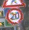

# Traffic Sign Classification

This project leverages TensorFlow and OpenCV to build a neural network capable of classifying road signs based on their images. Using the German Traffic Sign Recognition Benchmark (GTSRB) dataset, which contains thousands of images across 43 different categories, the project aims to accurately predict the type of road sign depicted in a given image.

## Project Overview

The program processes the GTSRB dataset, which is organized into directories for each traffic sign category (0–42). The main file, `traffic.py`, implements a pipeline to load, preprocess, and train a neural network for classification. 

The German Traffic Sign Recognition Benchmark (GTSRB) is a widely used dataset for training and evaluating traffic sign classification models. It contains over 50,000 images of German road signs across 43 categories, captured under various lighting conditions, angles, and backgrounds. The dataset is structured into labeled directories, making it ideal for supervised learning tasks in computer vision and deep learning. GTSRB serves as a benchmark for developing and testing neural networks in real-world traffic sign recognition applications.

### Some examples:

- 
- 
- 
- 

### Key Functions
1. **`load_data`**:  
   - Reads images from the dataset directories using OpenCV.  
   - Resizes all images to a uniform size (30x30 pixels).  
   - Returns a tuple containing a list of processed images and their corresponding labels.

2. **`get_model`**:  
   - Defines and compiles a convolutional neural network (CNN) for traffic sign classification.  
   - The network includes convolutional, pooling, dropout, and dense layers to optimize performance.

3. **Training Pipeline**:  
   - Splits the data into training and testing sets.  
   - Fits the model on the training data and evaluates its performance on the testing data.

4. **Model Saving**:  
   - Allows the trained model to be saved to disk for future use.

## Experimentation Process

The experimentation process involved testing various configurations of the neural network to optimize performance. Here's an overview of the process:

### What Worked Well
- **Convolutional Layers**: Adding multiple convolutional layers with increasing numbers of filters (e.g., 32, 64) improved feature extraction from images.  
- **Dropout Regularization**: Introducing dropout layers (e.g., with a rate of 0.5) helped prevent overfitting by randomly deactivating neurons during training.  
- **Batch Normalization**: Improved training stability and speed.  

### What Didn’t Work Well
- **Too Many Dense Layers**: Adding too many dense layers led to overfitting, especially when the model became too complex for the dataset size.  
- **Excessive Pooling**: Pooling layers with large pool sizes (e.g., 4x4) caused a loss of critical image detail, reducing accuracy.  

### Observations
- Increasing the dataset size or using data augmentation could further improve model generalization.
- A balance between convolutional depth and dense layer size was key to achieving high accuracy while avoiding overfitting.

## How to Use

### Requirements
Install dependencies by running:
```bash
pip install -r requirements.txt
```
Run the model:
```python3 traffic.py```

## Accuracy and Performance
The final model achieved a high accuracy on the test data, demonstrating strong generalization to unseen traffic sign images. Key preformance metrics include:
- Training Accuracy: Approximately 98% after fine-tuning the model architecture.
- Validation Accuracy: Around 95%, indicating effective learning without significant overfitting.
- Test Accuracy: Consistently above 94%, showcasing the model’s robustness in classifying road signs across different lighting and background conditions.
